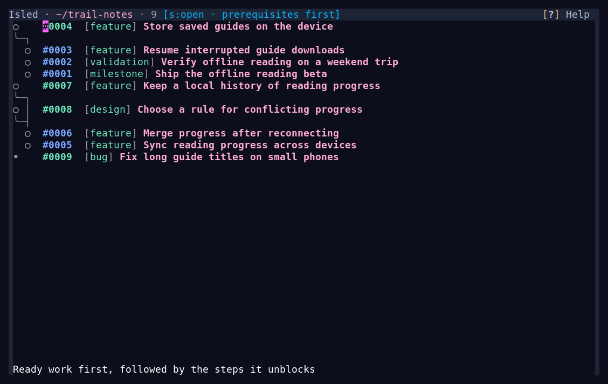
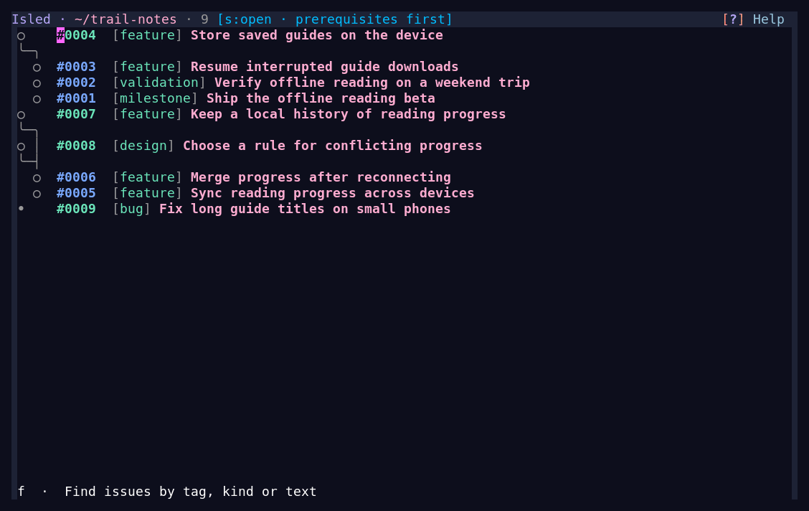

# Isled for Emacs

<a id="emacs-frontend"></a>

Browse your project's issues, follow their dependencies, and add or edit records
without leaving Emacs. Issues stay in ordinary Markdown files in the project's
`.issues/` directory.

[Install](#installation) · [Open a ledger](#getting-started) ·
[Browse](#navigation-and-folding) · [Filter](#issue-filtering) ·
[Edit](#add-edit-and-close-issues) · [Customize](#customization)

**See what is ready and what is waiting.** Expand an issue for its details, follow
a dependency, and return to where you were.



**Find the work you need.** Filter by status, tags, kind, or words anywhere in an
issue, with results updating as you type.



The demos use a fictional project, Trail Notes. The interface shown is the actual
Emacs package.

## Installation

You need **Emacs 30.1+** with built-in TLS and zlib support. Your package
manager installs **markdown-mode 2.6+** and **Transient 0.8.0+**. On first use,
Isled offers to download the matching CLI; no Rust compiler, PATH setup or
separate verification tools are needed.

### With your package manager

Use the [Elpaca, straight.el or built-in package-vc recipes](packaging.md).
They support the `release` branch, a fixed tag or commit, and development on
`main`. Isled is not yet listed on MELPA.

<a id="package-archive"></a>

### From the release archive

Download **`isled-0.32.0.tar`** from the [release page](https://github.com/cark/isled/releases/tag/v0.32.0).
Make the dependencies available through your configured GNU/NonGNU ELPA or
MELPA archives, and allow upgrades to bundled packages:

```emacs-lisp
(setq package-install-upgrade-built-in t)
```

Run `M-x package-refresh-contents`, then `M-x package-install-file` and select
the downloaded tar. Package installation resolves dependencies and registers
the commands and project shortcut.

Emacs 30's bundled Transient is too old for Isled. Restart Emacs if an older
Transient was already loaded when you upgraded it.

### First use

Visit your project and run **`M-x isled`**. Accept the CLI download when asked.
You can also run `M-x isled-setup-cli` to prepare it separately.

Managed downloads support x86-64 Linux and Windows, and Apple Silicon macOS;
see [platform requirements](../../README.md#requirements) for minimum versions
and test limits. [CLI setup and recovery](user-guide.md#cli-setup-and-upgrades)
covers cancellation, upgrades, offline reuse and separately installed executables.

<a id="local-configuration"></a>

For a source build or development checkout, follow the
[contributor setup](CONTRIBUTING.md#source-development-setup).

## Getting started

Visit a file or directory in your project and run **`M-x isled`**. You can also
press **`C-x p i`** to choose a known project, or run **`M-x isled-open-directory`**
to choose any local directory.

If there is no ledger, Isled offers to create one, open an existing parent ledger,
or cancel. It creates files only when you choose **Create ledger here**.
A new view shows open issues in a dependency hierarchy.

The `C-x p i` shortcut is installed only if that key is free;
`M-x isled-open-project` is always available.

<a id="opening-projects-and-directories"></a>

Use `C-u C-x p i` for an additional view with independent filters and folds.
The [project and view guide](user-guide.md#opening-projects-and-directories)
explains parent ledgers, view reuse and duplication.

## Navigation and folding

| Key | Action |
| --- | --- |
| `TAB` / `S-TAB` | Move between issue headings and links. |
| `RET` | Expand or collapse an issue; follow a link at point. |
| `C-TAB` / `C-S-TAB` | Move directly to the next or previous issue. |
| `j` | Find an issue by ID or title, including issues outside the filter. |
| `M-,` / `C-M-,` | Go back / forward through issue navigation. |
| `C-RET` | Collapse all issues. |
| `g` | Refresh. |
| `?` | Show commands and keys. |
| `q` | Quit the view. |

Some modified Tab keys depend on terminal support; all commands are also
available through `M-x`.

<a id="dependency-graph-view"></a>

The hierarchy places prerequisites before the work they unblock. Press `d` to
reverse that direction, or `v` to switch to a flat list. Issue-ID colors distinguish
ready, waiting and closed issues. Filtering can hide dependencies, so a visible
root is not necessarily ready. See [reading the graph](user-guide.md#dependency-graph-view).

<a id="issue-search"></a>
<a id="opening-issue-files"></a>
<a id="open-markdown-source"></a>

Opening a local issue file normally reveals it in the issue view. Press `s` to
open its Markdown source instead. See [file links and source access](user-guide.md#opening-issue-files).

## Issue filtering

Press **`f`** to edit the current query. Results preview while you type;
**`RET`** keeps the query and **`C-g`** restores the previous view.

<a id="search-examples"></a>
<a id="filter-examples"></a>

| Query | Find |
| --- | --- |
| `s:open t:sync` | Open issues tagged `sync`. |
| `k:bug` | Bugs, open or closed. |
| `s:closed "disk full"` | Closed issues containing the phrase “disk full”. |
| `t:mobile t:sync downloads` | Issues with both tags and the word “downloads”. |

All terms must match. These are complete queries: replace the existing text to
try one. No status term means both statuses. `O`, `C` and `A` choose Open, Closed
or All while keeping the other terms.

<a id="completion-interfaces"></a>
<a id="search-and-preview"></a>
<a id="filter-memory"></a>

`TAB` completes tags, kinds and statuses. The [filter guide](user-guide.md#issue-filtering)
covers quoting, completion interfaces and previews. Ordinary `C-s` searches text
already loaded in the buffer; use `f` to search complete issues across the ledger.

## Add, edit and close issues

Press **`a`** to add an issue or **`e`** to edit the issue at point. A draft opens
with fields for its title, kind, tags, statement, evidence, outcome and dependencies.

| In the editor | Action |
| --- | --- |
| `C-x C-s` | Save and keep editing. |
| `C-c C-c` | Save and return to the ledger. |
| `C-c C-k` | Cancel unsaved edits after confirmation. |
| `C-TAB` / `C-S-TAB` | Move between fields and buttons. |
| `TAB` | Complete a value or indent multiline text. |
| `C-c ?` | Show editor help. |

Press **`c`** in the issue view to prepare closure. Fill in concrete Evidence and
Outcome, then save to close the issue. Closure is terminal. Ordinary editing never
closes an issue, and canceling the closing draft leaves it open.

Errors appear beside fields. If the file changed while you were editing, Isled
keeps your draft and offers comparison and recovery choices. See the
[editing guide](user-guide.md#add-edit-and-close-issues) for conflicts and completion.

## Customization

Run `M-x customize-group RET isled RET` for options and faces. Common choices are
the [filter completion interface](user-guide.md#completion-interfaces),
[colors and fonts](user-guide.md#theme-and-identity-styling), and
[key bindings](user-guide.md#key-binding).

<a id="theme-and-identity-styling"></a>
<a id="face-reference"></a>
<a id="key-binding"></a>
<a id="presentation"></a>
<a id="identity-header"></a>
<a id="help-menu"></a>

The [user guide](user-guide.md) contains the full interaction and configuration
reference. `?` in a view and `C-c ?` in a draft keep help close at hand.

## Refresh and warnings

<a id="automatic-refresh"></a>
<a id="known-warnings"></a>

Isled refreshes when issue files change. Press `g` to refresh manually or retry
a failed refresh. Your filter is retained. A **Known warnings** indicator means
an issue needs attention; press `!` to visit the findings. The
[warning guide](user-guide.md#known-warnings) explains their scope and recovery.

## Contributing

<a id="bounded-loading"></a>
<a id="code-map"></a>
<a id="validation"></a>
<a id="private-graphical-checks"></a>
<a id="interactive-candidate-previews"></a>

Implementation, the code map, package building, isolated tests and demo recording
live in the [frontend contributor guide](CONTRIBUTING.md).
